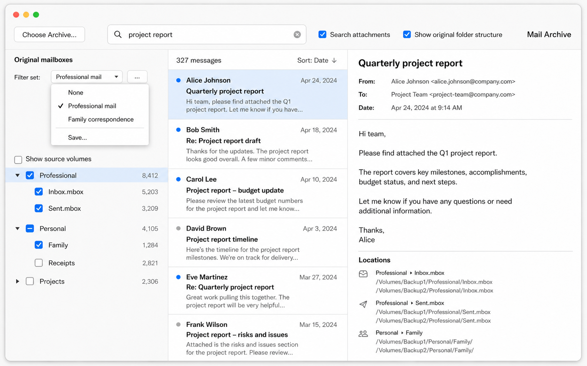

# Mail Archiver User Manual

This manual explains how an archivist creates and searches a mail archive.
Mail Archiver reads source mail without changing it. It stores deduplicated
messages in standard MBOX files, records where every message was found, and
creates integrity information that can be checked independently.

Mail Archiver currently reads:

* MBOX files;
* Emacs RMAIL Babyl files, including extensionless files;
* Maildir folders;
* individual `.eml` files; and
* complete Apple Mail `.emlx` files.

Babyl files are recognized from their `BABYL OPTIONS:` header, not their
filename. Both LF and CRLF RMAIL files are supported. Mail Archiver reads their
original-header blocks and bodies without changing the source files. When an
old record has no original-header block, its visible headers are used instead.
RMAIL labels and redundant visible headers remain only in the source Babyl
container and are not email content.

Outlook PST and OST files, Gmail, Microsoft 365, and live IMAP accounts are
planned but are not yet supported.
The code has inactive integration points for Gmail, IMAP, Microsoft Exchange,
and standard input containing NUL-separated messages; these are not CLI ingest
modes yet.

## Before you begin

Ask the person who installed Mail Archiver to confirm that:

1. `uv` and ClamAV are installed;
2. ClamAV has a current signature database; and
3. this checkout has been prepared with `uv sync`.

Choose two locations:

* **Source mail** is the existing mail that you want to archive. Mail Archiver
  does not change these files.
* **Archive directory** is where the new archive will be written. It should
  have enough free space for the mail, its indexes, and working files.

On macOS, reading Apple Mail or another protected location may require Full
Disk Access for the terminal application.

## Identify the archive owner

Mail Archiver separates sent and received messages. It needs a short text file
containing names or address fragments that identify the archive owner. Put one
lowercase value on each line. Blank lines and lines beginning with `#` are
ignored.

For example:

```text
# Names and address fragments used by the archive owner
jane.example
jexample
```

Review this file before ingest. A message is classified as sent when its
parsed `From:` address contains one of these values, without regard to case.

## Create or add to an archive

From the Mail Archiver checkout, run:

```console
make run ARGS='--archive "/path/to/mail-archive" ingest --owner-names-file owner-names.txt --clamav "/path/to/source-mail"'
```

You may supply more than one source at the end of the command:

```console
make run ARGS='--archive "/path/to/mail-archive" ingest --owner-names-file owner-names.txt --clamav "/Volumes/Backup1/Mail" "/Volumes/Backup2/Mail"'
```

You can instead set the archive location once in the terminal session:

```console
export MAIL_ARCHIVE_DIR="/path/to/mail-archive"
make run ARGS='ingest --owner-names-file owner-names.txt --clamav "/path/to/source-mail"'
```

### What happens during ingest

Mail Archiver:

1. loads the frozen plug-in registries, captures and deduplicates recognized
   source containers, totals their available sizes, and prints every
   unrecognized file and reason;
2. checks that ClamAV is ready before starting the mail workers;
3. reads, parses, and scans messages;
4. stores one canonical copy of each message;
5. records every source container, typed source-integrity check, and message
   observation in the private catalog;
6. updates the BagIt, Mailbag, and message-integrity information; and
7. prints a summary by year when ingest finishes.

Two messages are duplicates only when both their normalized `Message-ID` and
their raw-message SHA-256 match. A message found in several source mailboxes is
stored once, but every source location is remembered. Infected messages are
retained in the quarantine MBOX rather than silently discarded. Apple
`X-Apple-Auto-Saved` messages are recorded but are not copied into the
canonical mailboxes.
Exact empty Eudora MBCP metadata stubs are likewise recorded but not copied.
Legacy `From XXX` status wrappers are unwrapped and their nested email is
archived with the wrapper's source location retained.

Mail Archiver compares a valid `Date:` with a trimmed median of all valid
`Received:` dates after normalizing them to UTC. If they differ by more than
two days, the median controls catalog date and year routing. The original
header and message bytes remain unchanged. The graphical viewer identifies
these messages with a banner and a subtle red background.

If you know the first plausible year for an archive, add
`--earliest-year YEAR` to `ingest`. The default is 1900. For an archive whose
email history begins in 1983, use `--earliest-year 1983`; earlier `Date:` and
`Received:` values are rejected and the remaining source, stream, or path-year
fallbacks apply without rewriting the message.

The progress display shows overall bytes or completed unknown-size containers,
processed messages, estimated time remaining, provider phases, and each active
worker. Publication to the canonical MBOX files and catalog remains
single-writer.
The same status is atomically updated in a new `status/ingest-*.json` file in
the archive. That file retains final totals when the run finishes. Every later
ingest creates another file, so the archive accumulates a run history without
changing the database schema.

### Stop and continue safely

Press Control-C once for a controlled stop. Mail Archiver closes its files,
commits completed messages, writes an archive checkpoint, and prints a summary.

It is safe to run the same ingest command again. An unchanged source file is
verified by its source plug-in's complete-file control and skipped; its path
and reason are printed. A safely appended MBOX can
resume at its append boundary. Other changes cause the source file to be read
again; already archived messages remain deduplicated.

Source and physical file readers are manifest-loaded generators. Additional
plug-ins can be loaded with a repeatable `--plugin-dir DIRECTORY` option. That
directory contains executable Python, so use this option only with code you
trust. Gmail, IMAP, O365, Microsoft Exchange, and NUL-delimited stdin are
currently reserved names rather than working adapters. See `doc/PLUGINS.md`.

Do not edit files under `data/mbox/` while ingest is running.

## Extract printed email from a standalone PDF

This workflow is for a PDF that is itself the surviving source document after
email was printed and scanned. It is not for a PDF attachment inside an email.

The first implementation produces a standard, derived MBOX for human review:

```console
make extract-pdf-mail ARGS='tests/data/sipbadmin.pdf --output /tmp/sipbadmin.mbox --handwritten-page 2'
```

The command requires Poppler `pdftotext`. It reads and hashes the PDF without
changing it, classifies every page, extracts at most one printed message from
each qualifying page, refuses to overwrite the output, and reports non-message
pages. Repeat `--handwritten-page PAGE` for pages whose useful handwritten
annotations should be recorded. Their text is not extracted or indexed.

Each output record is labeled `machine-unreviewed` and records the source PDF
SHA-256, page range, extraction and segmentation policy, and handwriting flag.
After comparing the generated MBOX to the PDF, a human reviewer may correct the
derived text and change the status to `human-reviewed`. The reviewed MBOX is
still a derived interpretation; it is not original RFC 5322 source bytes.

This focused command does not yet copy PDFs into `data/pdf/`, route generated
records into `data/pdf-mbox/`, add them to search, suppress exact duplicates,
or connect the viewer to the source page. Those are the next archive-integration
steps.

## Verify the archive

Verify the archive after ingest and after copying it to new storage:

```console
make verify ARCHIVE="/path/to/mail-archive"
```

Verification reads the archive without changing it. It checks BagIt and
Mailbag structure, whole-file hashes, and the recorded hash for every message.
Investigate any reported failure before continuing to use or copy the archive.

The archive also contains `verify_mail_archive.py`. It can be copied with the
archive and run on a computer that does not have Mail Archiver installed:

```console
python3 /path/to/mail-archive/verify_mail_archive.py
```

## Search with the graphical interface

Start the graphical search interface with:

```console
make gui ARGS='--archive "/path/to/mail-archive"'
```

If no archive was supplied, the application opens the last valid archive or an
in-memory **Untitled** document. Use **File → Open…** or **Open Archive…** to
open an existing archive in a new window. **File → New Search Window** opens
another independently searchable window on the active archive. Recent archives
are kept in **File → Open Recent**. A missing or invalid saved archive is
ignored, removed from recents, and reported in the About window. **File → New**
asks for a new or empty `.mailarchive` destination before initializing and
opening it. **File → Import…** asks whether to select local files or directories,
asks for the UTF-8 owner-names file, shows the destination and sources for final
confirmation, and starts import using the separately installed ClamAV.
For a saved document, the window title shows the archive path and total number
of deduplicated, searchable messages.
On first launch with no usable archive, the Untitled window immediately offers
the New destination and then Import dialogs. Canceling leaves the blank window
open and does not choose or mutate any other path.

The About window remains available for the application run. It shows the
installed version, free disk space, live Internet reachability, startup errors,
warnings, and current or latest ingest activity. The Window menu lists it and
every search and Ingests window. During Import, the search window that started
the run cannot be closed from **File → Close** or its close box; other windows
remain searchable and independently closeable.

The status line at the bottom shows a running ingest, or summarizes the most
recent run. Click it to open the independent Ingests window. You can also use
**Window → Ingests**. The window lists all retained runs and shows the selected
run's sources, totals, failures, and every configured worker thread. It has its
own close box; opening it again while it is visible brings the same window to
the front.

Type ordinary words to search indexed headers and message text. The result
list is on the left and the selected message is on the right. The message view
also shows its canonical archive mailbox and every remembered source location.
MBOX byte locations appear as `path?offset=N` (with no suffix for offset zero).
Use the small copy icon beside a local source path to put that pathname, without
the offset, on the macOS pasteboard as both text and a file URL.
When there is spare vertical space in the message viewer, **Locations** remains
at the bottom of the pane.
Search and viewing do not modify the archive.

Ordinary search words and textual selector values are highlighted with a yellow
background wherever they appear in the selected message's displayed headers or
body. Matching is case-insensitive and works in the HTML, plain-text, and
raw-source views. Thus `from:beth` highlights `beth` in the displayed From
header. Quoted text is highlighted as one phrase; date selectors remain filters
and do not create highlights. Highlighting changes only the viewer; it never
changes canonical message bytes or the search index.

With a message selected, press Command-F to open **Find in message**. It starts
with the first textual part of the archive search—so `from:beth` starts with
`beth`—and selects that value so you can replace it. The finder highlights the
replacement text in the message. Press Command-G for the next match or
Shift-Command-G for the previous one. Selecting another message keeps the find
text but restarts at that message's first match, including an HTML message body.

Command-A follows where you last clicked. In the result list it selects every
result row. In a plain-text or raw-source message it selects that displayed
message body, not the viewer headers, attachments, or **Locations** evidence;
an HTML message uses the browser's native text selection. Use the ⧉ control in
the message toolbar to copy the visible text. For HTML, the copied text also
includes the displayed subject and message headers.

Mail Archiver searches an archival collection; it is not an inbox or mail
program. A search therefore covers the collection's complete time span. Recent
messages receive no preference beyond an explicitly selected date sort, and an
archivist never has to ask the application to check older years.

After three characters, the search box suggests matching addresses and
subjects. Each suggestion shows the number of deduplicated messages in which
it occurs. Address matching includes display names and email addresses, though
only email-address substrings have a dedicated accelerator. Subject matching
finds the characters anywhere in the subject, so `beth` also finds `ELISABETH`.
Use the arrow keys and Return, or click a suggestion.

Selecting an address creates a filter in the search box. Its pop-up menu
controls where that address must occur:

* **Any** searches From, To, Cc, and Bcc;
* **From** searches senders;
* **To**, **Cc**, and **Bcc** search only that header role.

Select **×** or press Delete with an empty search field to remove the last
filter. Selecting a subject completion creates a removable **Subject** filter.

Useful search forms include:

| Search | Meaning |
|---|---|
| `budget` | indexed headers and message text contain budget |
| `any:alice@example.org` | sender, To, Cc, or Bcc contains this address |
| `from:alice@example.org` | sender address contains this value |
| `to:bob@example.org` | a To recipient contains this value |
| `cc:bob@example.org` | a Cc recipient contains this value |
| `bcc:bob@example.org` | a Bcc recipient contains this value |
| `subject:"annual report"` | subject contains this phrase |
| `date:2024-03-15` | message date is this UTC calendar day |
| `before:2024-01-01` | message is earlier than this date |
| `after:2024-01-01` | message is later than this date |

All supplied terms must match. Use the sort controls above the result list to
sort the complete matching set by date, subject, or sender. The application
first counts up to 2,001 matches. If that scan ends at 2,000 or fewer, the
count is exact and every result is displayed. Otherwise it displays the first
2,000 in the selected sort order and automatically retrieves the rest. During
that work the result status is red, says **Searching in background**, and shows
the displayed count. When the background search finishes, the full result set
and exact count are shown. Starting another search supersedes the earlier
background work.

Pressing Return with an empty search field displays no results. Enter a term,
selector, search-box filter, or original-mailbox selection to define an
archival search. The result pane shows this complete search-language table and
examples when the program starts and whenever the search is empty.

Select **Search attachments** to include indexed text attachments. This works
only after an attachment index has been built:

```console
make run ARGS='--archive "/path/to/mail-archive" refresh-index --index-attachments'
```

PDF and Microsoft Office attachment extraction is not implemented yet.

## Viewing messages

Select a search result to view it beside the result list, or double-click the
result to open it in an independent window. That window has its own scrollbar,
so the complete message, attachments, and **Locations** section remain
reachable. The pull-down menu above the message
lists its displayable plain-text and HTML MIME parts and always offers **Raw
Source**, which shows the complete RFC 5322 message. Command-1 through Command-9
select the part with that numeric MIME part ID; Command-0 and Command-Shift-U
select **Raw Source**. If a message supplies more than one HTML part, Mail
Archiver initially displays the most substantial decoded one; every part
remains available from the menu.

Some early Netscape messages use `<x-html>...</x-html>` around an HTML body even
though their multipart declaration has no usable MIME boundaries. When the
wrapper encloses the entire body, the viewer recognizes it automatically,
offers **HTML — legacy x-html**, and selects that HTML view by default. A message
that merely mentions `<x-html>` in ordinary text is not reinterpreted. **Raw
Source** remains available, and this display recovery never changes the archived
message bytes.

All HTML views are sanitized before display. Scripts, forms, plugins, file URLs,
event handlers, and unsafe URL schemes are removed. Remote images remain blocked
unless you choose **Load Remote Content** for that message; embedded CID images
may render from the verified message. Hovering an allowed link shows its complete
destination in the bottom status bar. Clicking it shows the destination and
offers **Open Link**, **Copy Link**, and **Ignore**; a link opens only after you
choose **Open Link**.

### Date adjusted

The archive normally routes a message using its `Date:` header. When a usable
`Date:` value is more than two days from the trimmed median of the usable dates
in its `Received:` headers, the archive instead uses that median in UTC and
marks the catalog date source as `received-median`. The message then has a
red-tinted warning such as:

> **Date adjusted:** The date in the Date: header (Tue, 31 Dec 2024 12:00:00
> +0000) is more than two days from the median date of the Received: headers
> (2024-02-02T00:00:00+00:00). **Archive routing uses the computed UTC date
> (2024-02-02T00:00:00+00:00).**

The first value is the original `Date:` header exactly as decoded for display.
The second is the computed UTC median of the usable `Received:` header dates.
The third is the UTC date used to place the message in the archive. The median
and routing dates are currently the same, but both are shown so an archivist can
see the source evidence and the resulting routing decision. The original header
and canonical message remain unchanged.

Attachments and their previews appear below the body. Opening an attachment is
always explicit, with an additional warning for executable or container types.
The bottom of the message view separately lists the canonical archive mailbox
and every source volume and source or forensic path where the message was found.
**Save Message…** exports an exact, SHA-256-verified `.eml` copy without changing
the archive. To drag a message to Finder, use the message-file icon beside its
headers. The application creates no temporary mail files while you browse or
hover over results. The first drag prepares the verified disposable `.eml` file;
drag it again to transfer the ready file.

## Filter by original mailbox

Select **Show original folder structure** to display the **Original
mailboxes** tree before the result list.



The tree behaves as follows:

* Counts are distinct, deduplicated canonical messages, not source
  occurrences.
* Select the checkbox beside a folder to select everything below it. A dash in
  a folder checkbox means that only some contents are selected. Several
  folders or mailboxes can be selected at the same time.
* Selected branches are combined: a result may come from any selected branch.
  The result itself still appears only once.
* A directory whose contents are all single-message EML or EMLX files is shown
  as one logical mailbox rather than thousands of message filenames. A valid
  Maildir is shown at its root, not as `cur`, `new`, or individual message
  files. Apple Mail cache paths end at their `.mbox` package names and omit
  internal UUID, `Data`, bucket, `Messages`, and `.emlx` components.
  `[Gmail].mbox` observations are labeled as local Gmail cache copies. If the
  same message was acquired directly from Gmail, that provider observation is
  shown first as the preferred source; both observations remain in the catalog.
* Source volumes are hidden by default. Matching logical paths are merged, so
  `Professional` from `/Volumes/Backup1` and `/Volumes/Backup2` appears once.
  The message viewer continues to list the actual source volumes and paths.
* **Show source volumes** separates the tree by source volume when that detail
  is needed.
* Hiding the tree keeps its selection but disables the original-mailbox
  filter. Showing the tree again restores the selection and filtering. A
  hidden tree never filters results.

### Filter sets

The **Filter set** pop-up replaces a clear-selection button:

* **None** is permanent and means that no original-mailbox filter is applied.
  **Current selection** appears while a selection has not yet been saved.
* A named filter set restores its saved mailbox and folder selections.
* **Save...** asks for a name and saves the current selection. It can also clone
  an existing filter set under a new name.
* The **...** button opens the filter-set manager. The manager lists every saved
  set and allows it to be renamed or deleted. **None** cannot be renamed or
  deleted.

Filter sets are preferences for the current computer. They are stored in the
operating system's standard per-user preferences location (`Library/Preferences`
on macOS, roaming application data on Windows, or the XDG configuration folder
on Linux), not inside the mail archive. They therefore do not change the archive
or travel with it unless the preferences are copied separately.

## Search from the command line

Use command-line search for scripts, remote sessions, or plain-text output:

```console
make search ARGS='--archive "/path/to/mail-archive" to:alice@example.org budget'
make search ARGS='--archive "/path/to/mail-archive" subject:"annual report" after:2024-01-01'
```

The default is ten results. Use `--limit 0` to print every match:

```console
make search ARGS='--archive "/path/to/mail-archive" --limit 0 budget'
```

Every result begins with a stable message number. Supply that number by itself
to display the message:

```console
make search ARGS='--archive "/path/to/mail-archive" 42'
```

Add `--headers` for all headers, `--html` for decoded HTML, or `--mime` for the
complete RFC 5322/MIME source.

## Rebuild the search index

The search database is derived data. Rebuild it from the canonical messages if
it is missing or damaged:

```console
make run ARGS='--archive "/path/to/mail-archive" refresh-index'
```

This does not change the canonical MBOX files. Add `--index-attachments` to
include supported text attachments.

## Care of the archive

* Keep at least two independent copies on different storage systems.
* Run verification after ingest, after a copy, and periodically during storage.
* Do not edit the canonical MBOX files or integrity files by hand.
* Treat `archive.sqlite3` as private: it records source volumes and paths.
* `search.sqlite3` is disposable and may be rebuilt from the canonical mail.
* Preserve the entire archive directory, including hidden and small tag files.

## Configuration

Mail Archiver's current application-level configuration is the versioned YAML
file `src/mailarchiver/configuration.yaml` in the source checkout. It currently
controls the search-highlight background used by the graphical message viewer:

```yaml
version: 1
gui:
  search_highlight_background: "#fff59d"
```

The color must be a six-digit hexadecimal CSS color beginning with `#`. The
initial value, `#fff59d`, is yellow. Stop and restart the graphical interface
after changing the file; configuration is validated and loaded once when the
application starts. Mail Archiver rejects unknown settings, unsupported
versions, and invalid color values instead of passing them to the viewer.

This YAML file contains packaged application display policy. It does not
replace:

* `owner-names.txt`, which identifies the archive owner for Sent routing;
* `MAIL_ARCHIVE_DIR` or `--archive`, which selects an archive;
* the installed ClamAV configuration; or
* saved original-mailbox filter sets, which remain per-user preferences.

Changing the highlight color affects only derived display rendering. It does
not modify the source mail, canonical MBOX files, catalog, or search database.
